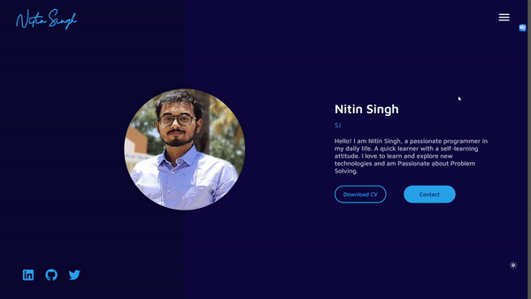

# Personal Portfolio Website

Welcome to my personal portfolio website built with React.js and Next.js! This project showcases my skills, projects, and experiences as a web developer. Feel free to explore and learn more about me and my work.

## Demo :movie_camera:

## Table of Contents

- [Getting Started](#getting-started)
- [Features](#features)
- [Technologies](#technologies)
- [Setup](#setup)
- [Usage](#usage)
- [Deployment](#deployment)
- [License](#license)

## Getting Started

### Prerequisites

- Node.js and npm installed on your local machine

### Clone the Repository

git clone https://github.com/nitinsingh0219/nitin-react-portfolio.git
cd portfolio-website

## Features

- Responsive design for various screen sizes
- Showcase your projects, skills, and experiences
- Smooth navigation with page transitions
- SEO-friendly for better discoverability
- Easily customizable for personalization

## Technologies

- React.js
- Next.js
- HTML/CSS
- JavaScript
- [Insert additional technologies used]

## Setup

1. Install dependencies:

npm install

2. Customize the content:

   - Update the content in the `src` directory to reflect your own information, projects, and skills.
   - Modify the styles in the `styles` directory to match your personal branding.

## Usage

Run the development server:

npm run dev

Your portfolio website will be available at `http://localhost:3000`.

Customize and expand the website by adding your own projects, blog posts, or any other content you want to showcase.

## Deployment

To deploy your portfolio website, you can use platforms like Vercel, Netlify, or GitHub Pages. Make sure to configure your deployment settings according to the platform of your choice.

## License

This project is licensed under the MIT License - see the [LICENSE](LICENSE) file for details.

---

Thank you for checking out my personal portfolio website project. I hope you find it helpful in creating your own impressive online presence. If you have any questions or suggestions, feel free to contact me. Happy coding!

